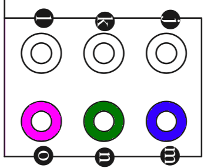

# Hackintosh

I built my Hackintosh because I was disappointed with the price of the new Mac Mini 2018. Its configuration is close to the new mid-entry Mac Mini but with more RAM (16 instead of 8 Gb). Here are the specs:

- MacOS Mojave 10.14.6
- Intel i5-8400 (6 cores @ 2.80 Ghz, 3.80 Ghz Turbo Boost)
- Gigabyte Z370-HD3P
- Corsair Vengeance LPX 16Gb (2x8Gb) DDR4 2666MHz OC @ 3200 Mhz (CMK16GX4M2A2666C16)
- EVGA 600 W1, 80+ WHITE 600W
- SSD SAMSUNG 830 Series 256 Gb
- Various old HDDs
- Apple Wired Keyboard
- Microsoft Wireless Mobile Mouse 1000
- M-Audio Fast Track Pro
- Yamaha HS5
- Philips 244E 24" 1080p monitor

## Installation

The installation was pretty straight forward. If you go like me with only the integrated Intel GPU (UHD 630), a Coffee Lake CPU, and this motherboard, just follow the [vanilla guide](https://hackintosh.gitbook.io/-r-hackintosh-vanilla-desktop-guide/) and read the "Coffee Lake" page carefully.

You can basically download the config file provided at the end of the vanilla guide, it works almost OOTB.

## BIOS

You can find my BIOS Settings with pictures [here](BIOS/README.md).

## My EFI

* **Clover version**: v2.5k r5070
* **UEFI Drivers** (now located in `EFI/Clover/drivers/UEFI`):
    - _ApfsDriverLoader.efi_
    - _AptioMemoryFix.efi_
    - _HFSPlus.efi_
* **Kexts** (in `EFI/Clover/kexts/Other`):
    - _AppleALC.kext_
    - _IntelMausiEthernet.kext_
    - _Lilu.kext_
    - _SMCProcessor.kext_
    - _SMCSuperIO.kext_
    - _USBInjectAll.kext_
    - _VirtualSMC.kext_
    - _WhateverGreen.kext_

if you use my EFI folder & BIOS Settings, there are two things you need to do. First, you need to generate by yourself your serials and put them in the `config.plist`. You can use [macserial](https://github.com/acidanthera/macserial) to generate serials for the model you picked. I first chose `Macmini8,1` because my config was similar to the new Mac Mini model but I recently changed my SMBIOS to `iMac19,2` due to the black screen issue I was having while watching videos in full screen. (**Update:** Apparently this was a bug on macOS and it has been fixed in 10.14.6).

**Note:** I use the [Clover-Minimal Theme](https://github.com/al3xtjames/clover-theme-minimal) in my `config.plist` so if you only download my `config.plist`, be sure to either install this theme or change it to something you already have.

## What works

* UHD 630 Integrated Graphics
* Turbo Boost
* Ethernet
* USB 2 / USB 3 Ports
* HDMI Out
* DVI-D Out
* Sleep / Wake up
* Sound (see below)

## Sound

As I mentioned in my setup above, I use an USB Audio interface for input/output. Therefore, I don't use that much (almost never) the inputs/outputs provided on the back of the motherboard.

Nevertheless, this EFI/config.plist should allow you to use sound I/O provided by the motherboard without any problem. 

With the AppleALC layout id set to "1" (already done in my `config.plist`), I was able to use:

* my headphones ;
* a microphone ;
* also the "Line In" to send music from my smartphone to macOS.

To use the sound inputs/ouputs of this motherboard, I did:

* Set `alcid` clover boot options to "1" (already done here) ;
* Use the "Pink" input (Mic In) for my microphone (and set "Built-in Microphone" in macOS Sound Settings) ;
* Use the "Green" input (Line Out) for my headphones (and set "Built-in Speakers" in macOS Sound Settings) ;
* Use the "Blue" input (Line In) to send sound to my Hack ("Built-in Line In" in macOS).

## Benchmarks

Link: https://browser.geekbench.com/v4/cpu/14018360

